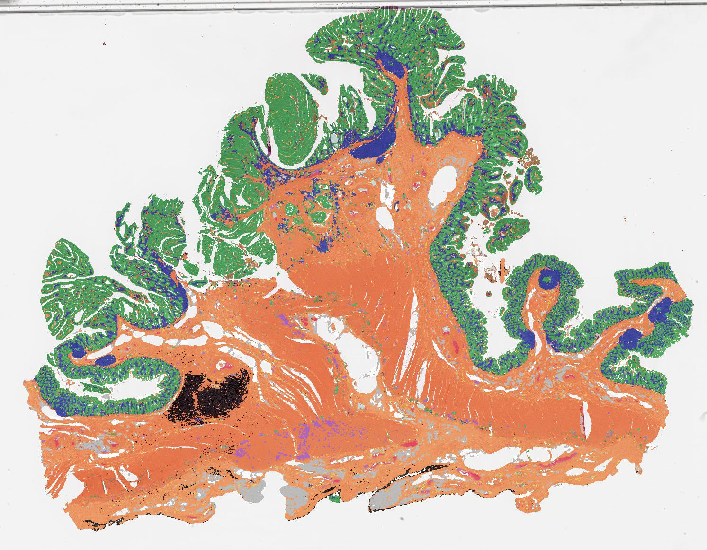

# Pancancer-tissue-atlas

This repository is related to submitted manuscript 'Tissue Atlas for Pan-cancer Tumor Microenvironment Analysis' to npj Digital Medicine.

Using U-Net and Vgg networks, we generated tissue category segmentation map (referred as tissue atlas) and tumor map for giga-pixel diagnostic whole-slide images in 8 cohorts of TCGA Project (TCGA-BRCA, TCGA-COAD, TCGA-LUAD, TCGA-LUSC, TCGA-OV, TCGA-PAAD, TCGA-STAD, and TCGA-UCEC). This repo will make all the tissue atlas and tumor map available to support advanced investigations. Currently, a few example maps have been made available. The full atlas resources will be available upon acceptance of this work.

You can access the (part of, currently) maps via this link (Baidu Netdisk):

 https://pan.baidu.com/s/1HPH7WaeLFNtbnWiFQiGOiQ?pwd=atls 

Access code：atls 

**The atlas is shared for research purpose only. You should not use it for commercial products (including promotion, using it to training close-sourced commercial models, etc. )**

## Tissue Atlas

Tissue atlas is a single-channel gray-level image. The value of each pixel ranges from 0 to 15. Value 1 to 15 represent following classes, respectively：
1.  Background
2.  Lymphocytes or immune infiltration
3.  Necrosis
4.  Adipose
5.  Fibrous stroma
6.  Muscle
7.  Nerves
8.  Alveolar
9.  Cartilage
10. Blood cells
11. Micro-vessels
12. Mucus or sediment
13. Carbon deposition
14. Epithelial-like tissue
15. Artifacts

Value 0 represent irrelevant regions for analysis, such as glass background, out of focus, marker pen-polluted region, and folded tissues.

You may check the results visually in $Cohort$-vis folder. Here are some examples:

The color scheme of the visualized examples are as follows:

Please note that:
1. All the tissue atlas files are saved at pixel spacing of 8μm. The original files were saved at 0.5μm/pixel, which are too large to share. You may contact Yiping (ping@nuist.edu.cn) for further assistance of accessing full-size maps.
2. Mis-classification may happen. For example, we notice confusion among stroma, muscle, and nerves in some slides. For this specific problem, we merged the three class before TME analysis. Hopefully, we will able to refine this problem and update the maps in the future. 
3. Despite most of the slides were segmented well, some of them were of insufficient quality. Please refer to the Quality Control section in supplementary materials of our manuscript.

## Tumor map

Tumor map is a single-channel binary image, where 1 indicate recognized tumors, and 0 for else. You may check the results visually in $Cohort$-vis folder (with heatmap). Here are some examples:

Despite most of the tumors were detected correctly, false positive and false negative may exist. In our analysis we also filted the maps with pre-generated foreground masks. We also used the concept of main tumor region (connected components that are larger than 10% of the largest one) rather than the raw mask in our analysis. 

##  Tissue features

To be added (upon acceptance)

##  Survival analysis and predicting molecular features

To be added (upon acceptance)